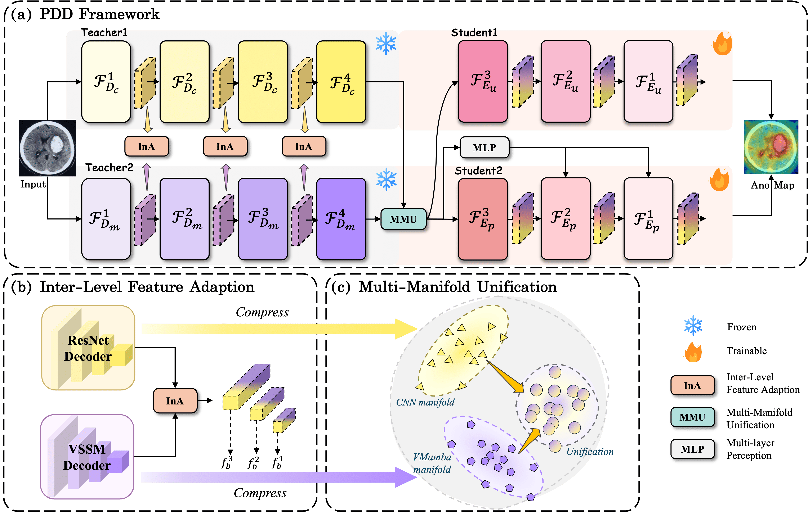
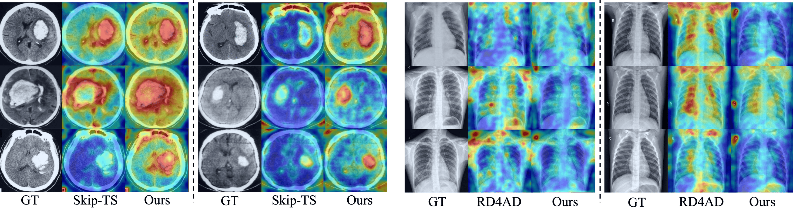

<!-- <p align="center">
  <h1 align="center">Manifold-<font color=#FF80AB>P</font>rior <font color=#FF80AB>D</font>iverse <font color=#FF80AB>D</font>istillation for<br>
    Medical Anomaly Detection
  </h1>
  <p align="center">
    <a href="https://github.com/OxygenLu">Xijun Lu</a> ·
    <a href="https://scholar.google.com/citations?hl=zh-CN&user=S0pp67AAAAAJ">Hongying Liu</a> ·
    <a href="https://scholar.google.com/citations?user=rk_HZTkAAAAJ&hl=zh-CN">Fanhua Shang</a> ·
    <a href="https://scholar.google.com/citations?user=Ot5FpIEAAAAJ&hl=zh-CN&oi=ao">Yanming Hui</a> ·
    <a href="https://cic.tju.edu.cn/faculty/lwan/index.html">Liang Wan</a>
    <br>Tianjin University · Medical School & College of Intelligence and Computing<br>
  </p>
  <h2 align="center">CVPR 2026</h2>
  <h3 align="center">
    <a href="https://github.com/OxygenLu/PDD">Code</a> |
    <a href="https://arxiv.org/pdf/2603.07142">Paper</a> |
    <a href="https://OxygenLu.github/xxx">Project Page</a>
  </h3>
  <div align="center">
    <a href="https://pytorch.org/get-started/locally/"></a>
    <a href="https://pytorchlightning.ai/"></a>
  </div>
</p> -->
<p align="center">
  
</p>

<p align="center">
  <a href="https://github.com/OxygenLu">Xijun Lu</a> ·
  <a href="https://scholar.google.com/citations?hl=zh-CN&user=S0pp67AAAAAJ">Hongying Liu</a> ·
  <a href="https://scholar.google.com/citations?user=rk_HZTkAAAAJ&hl=zh-CN">Fanhua Shang</a> ·
  <a href="https://scholar.google.com/citations?user=Ot5FpIEAAAAJ&hl=zh-CN&oi=ao">Yanming Hui</a> ·
  <a href="https://cic.tju.edu.cn/faculty/lwan/index.html">Liang Wan</a>
  <br>
  Tianjin University · Medical School & College of Intelligence and Computing
</p>

<h2 align="center">CVPR 2026</h2>

<h3 align="center">
  <a href="https://github.com/OxygenLu/PDD">Code</a> |
  <a href="https://arxiv.org/pdf/2603.07142">Paper</a> |
  <a href="https://oxygenlu.github.io/xxx">Project Page</a>
</h3>

<div align="center">
  <a href="https://pytorch.org/get-started/locally/">
    
  </a>
  <a href="https://pytorchlightning.ai/">
    
  </a>
</div>

<p align="center">
  
</p>

<p align="center">
  
</p>

PDD is a medical image anomaly detection framework based on manifold-prior diverse distillation. It uses two frozen teachers, VMamba-Tiny for global context and Wide-ResNet50-2 for local structure, and trains a lightweight PDD decoder to reconstruct and align multi-level features.

This repository is a cleaned training subset refactored from `VAD-TS`. It contains the single-class DDP training script, the multi-class DDP training script, dataset utilities, evaluation utilities, visualization code, and model definitions. Model weights are not stored in this project.

<p align="center">
  
</p>

## News

- [2026/02/21] PDD is accepted to CVPR 2026.

## Project Structure

```text
PDD/
  models/
    mamba_decoder.py          # PDD decoder, entry: pdd_decoder
    resnet_encoder.py         # Wide-ResNet50-2 encoder
    vmamba.py                 # VMamba timm registration
  scripts/
    train_two_twins_ddp.py    # single-class DDP training
    train_two_twins_ddp_multi.py
                               # multi-class DDP training
    vis_eval.py               # test-set inference and visualization
  utils/
    dataset.py                # single-class dataset
    dataset_full.py           # multi-class meta.json dataset
    evaluation.py             # evaluation helpers
    losses.py                 # training losses
    utils.py                  # common helpers
  static/                     # README figures
  checkpoints/                # local checkpoint output, ignored by git
  logs/                       # TensorBoard output, ignored by git
```

## Environment

Create the environment from the exported conda file:

```bash
cd /PDD
conda env create -f environment.yml
conda activate vmamba
```

Or install from pip requirements if you already have a compatible CUDA/PyTorch environment:

```bash
pip install -r requirements.txt
```

## Data

### Single-Class Data

The single-class script expects an MVTec-like layout:

```text
data_path/
  train/
    good/
      xxx.png
  test/
    good/
      xxx.png
    anomaly_type/
      xxx.png
```

Image suffixes are matched case-insensitively for common formats such as `png`, `jpg`, `jpeg`, and `jepg`.

### Multi-Class Data

The multi-class script uses `utils/dataset_full.py` and expects a `meta.json` file under `data_path`:

```text
data_path/
  meta.json
  class_a/...
  class_b/...
```

`meta.json` should contain `train` and `test` sections. Each class contains a list of records with at least:

```json
{
  "img_path": "relative/path/to/image.png",
  "anomaly": 0
}
```

For training, only records with `"anomaly": 0` are used.

## Training

### Single-Class DDP

```bash
CUDA_VISIBLE_DEVICES=4,5 torchrun --nproc_per_node=2 scripts/train_two_twins_ddp.py \
  --data_path /your/path/data/head_ct \
  --save_path /your/path/PDD/checkpoints/head_ct
```

### Multi-Class DDP

```bash
CUDA_VISIBLE_DEVICES=4,5 torchrun --nproc_per_node=2 scripts/train_two_twins_ddp_multi.py \
  --data_path /your/path/data/medical \
  --class_list brain,liver,retinal \
  --save_path /your/path/PDD/checkpoints/multi_tao_0375
```

Default training settings follow the `tao_0375` branch:

- `res=10`
- `layerloss=4`
- decoder entry: `models.mamba_decoder.pdd_decoder`

## Visualization

Run test-set inference and save original image, heatmap, overlay, and comparison images:

```bash
CUDA_VISIBLE_DEVICES=5 python scripts/vis_eval.py \
  --device cuda:0 \
  --output_dir /your/path/PDD/vis/head_ct
```

The checkpoint path and default `head_ct` data path are currently defined in `scripts/vis_eval.py`.

## Outputs

Training writes:

- checkpoints to `checkpoints/`
- TensorBoard logs to `logs/`

Visualization writes:

- original images to `vis/*/org/`
- heatmaps to `vis/*/heatmap/`
- overlays to `vis/*/overlay/`
- side-by-side comparisons to `vis/*/compare/`

## Notes

- No trained weights are committed in this repository.
- Teacher pretrained weights are loaded through the model definitions and the local PyTorch/timm cache.
- Use `torchrun` for DDP training. `CUDA_VISIBLE_DEVICES` controls which physical GPUs are visible; inside the script each process uses its local rank.

## Citation

If you find our code or paper useful, please cite:

```bibtex
@inproceedings{lu2026pdd,
  title={PDD: Manifold-Prior Diverse Distillation for Medical Anomaly Detection},
  author={Lu, Xijun and Liu, Hongying and Shang, Fanhua and Hui, Yanming and Wan, Liang},
  booktitle={Proceedings of the IEEE/CVF Conference on Computer Vision and Pattern Recognition},
  pages={28534--28544},
  year={2026}
}
```

## Acknowledgement

This project builds on VMamba. We thank the authors for their excellent work:

- [VMamba](https://github.com/mzeromiko/vmamba)
